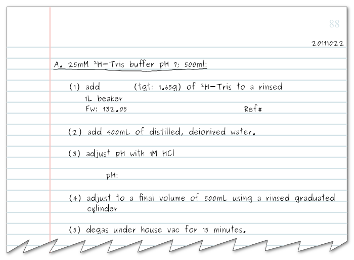
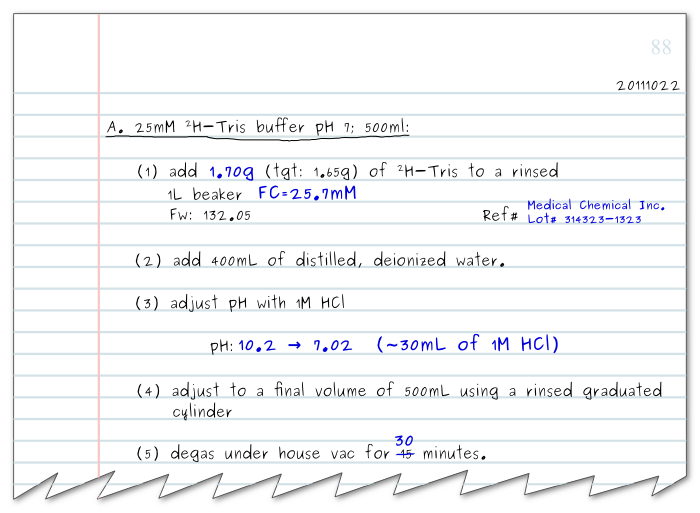
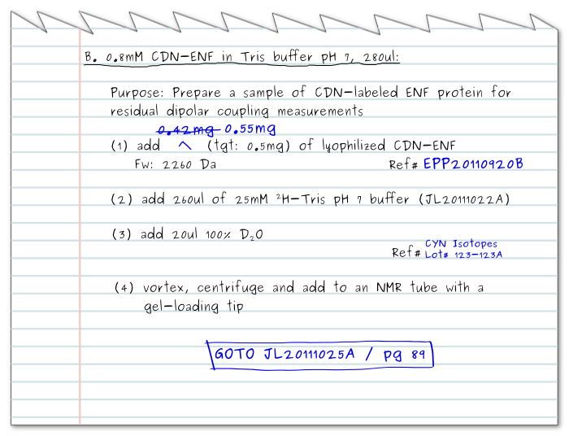
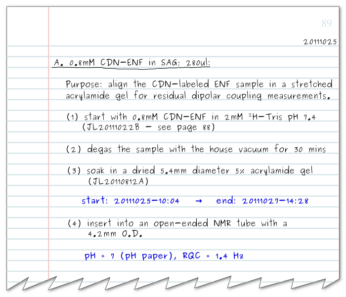

Notebook Format
***************

(Adapted with persmission from
`this link <http://www.lorieau.com/instruments-and-protocols/notebook-style.html>`_)

The core of my note taking style works around dates and projects. Days are
written in the YYYYMMDD format–20111025, for example. This format increases in
the last digits of the number, and it ensures that files and directories
created on a computer are easily sorted by date.

Every day can have one or more projects which begin from the letter ‘A’ and
increase alphabetically. So the first project of the day would be 20111025A,
and the second would be 20111025B. A project can either be a sample, a solution,
a protocol–such as a column purification–or an experiment. Within each project
are the individual steps, starting from (1), (2), and so on.

This is best illustrated by an example. Suppose I have 25mM Tris buffer to make:

The notes, as written above, are prepared before an experiment, or during an
experiment–but not after! The top right corner of every page begins with the
current date in YYYYMMDD format. If the first project of the day begins in the
middle of the page, the date is also inserted on the right-hand side of the
line preceding the project title.

The first project begins with the project letter and a project title,
both underlined. In this case, the type of buffer (25mM 2H-Tris pH 7) and the
volume are included.

The first step involves adding a chemical–Tris, in this example. The target
mass is indicated (tgt: 1.65g), the formula weight (Fw) and a space for the
reference information. Subsequent steps list the remaining steps needed to
finish the project. As the steps are completed, the blanks are filled-in.
Alternatively, a little point or check can be marked to the left of each
step number (not shown here).

he exact mass of the Tris is inserted in step (1), and the supplier and lot
number are inserted in the reference. Filling in the supplier information may
seem pedantic at first, but writing in this simple line can and likely will
save you countless hours and tears. It is used, first and foremost, to report
the supplier of chemicals when writing up a manuscript, giving the actual
suppliers of the chemicals used instead of guessing from the labels on the
bottles from your shelves when writing. Importantly, however, the lot number
can also be used to find bad batches of chemicals or contaminated reagents
that have ruined a batch of experiments. When pinpointing a problem with
contamination, finding the common denominator couldn’t be easier when the lot
number is recorded for each chemical.

Step (3) records the adjustment in pH, taking note of the initial and final
values, and the volume of acid needed. Keeping track of these details not only
helps others follow your work, it can guide you in tracing possible problems
with samples or methods. If, for example, the next time you prepared a
25mM Tris buffer the initial pH was 7, then you would know that something was
amiss.

Finally, deviations in the protocol are noted in the space between the steps,
and for this reason, it is useful to have plenty of space between steps. For
step (5), the actual time to degas the buffer was 30 minutes. The correction
was noted by striking through the tentative number, 15 minutes, with a single
horizontal bar. The crossed values should remain completely legible so that
others may see and repeat your original protocol. (Not to mention that
sometimes it’s possible to make mistakes when marking mistakes.)

Referencing
===========

Here is another example which illustrates how referencing works–and a few new
ideas.

In this project, a protein sample is prepared for an experiment. After
step (4), this sample is presumably used for NMR experiments–you would have to
check the corresponding instrument notebook to find out. Subsequently, this
sample has been used to make a new sample, which can be found in project
JL20111025A (on page 89).

The GOTO statement indicates that the project continues onto another project,
and it is useful for tracing the lineage of samples and experiments. GOTOs
are used when a sample has been changed, or when an experiment has multiple
steps that span multiple days. This GOTO statement makes use of both
internal and external referencing.

Internal References
-------------------

Internal references are links to other projects within the notebook by the
use of a page number. It is common to have an experiment that builds on or
copies procedures from a previous experiment. In this case, simply referencing
the page number and the items referenced within the notebook gives enough
context. However, since internal references only make sense within a notebook,
they can only be used there, and at times, they can introduce ambiguity if
multiple projects are present on a page. For this reason, I typically write
down an internal reference together with an external reference.

External References
-------------------

The external reference format is used for identifying a project inside and
outside of a notebook. It combines the experimentalist’s initials (JL),
the date in YYYYMMDD format (20111025) and the project letter (A). External
references are used to uniquely identify the project in other notebooks or
sample tubes. Sometimes I will further specify the step number
(i.e. JL20111025A-(4)) if the project is on-going or the sample comes from an
earlier step in the project.

These can be used to help chain together projects with GOTO statements.
Continuing from our example above, we’ve created a new project from
JL20111022B.

The first step of project JL20111025A notes that this is a continuation of
project JL20111022B. (Alternatively, this reference could have been marked
with a ‘Ref#’ field.)

Note also that a statement of purpose has been included in this project.
A statement of purpose or a justification of the choices you’ve made for
individual steps in an experiment can give the reader useful cues and context;
use these often, but be concise and direct in your remarks.

Other Guidelines
================

#. Write only in pen–not pencil. You can only add to a true record.

#. Cross-out with a single horizontal bar. The values that are crossed out
   should still be readable.

#. You can add figures, gels and other data to your notebook, but never
   remove them. If a space or page is left blank, mark an ‘X’ on it, and
   state that the space was left blank intentionally.

#. Do not remove the notebook from the lab–make photocopies. This protects your
   notebook from being lost, and it protects you from contamination on your
   notebook.

#. Take notes before and during an experiment, but do not write notes after
   you’ve conducted an experiment. You will invariably get some of the details
   incorrect.

#. Mark the reference number (i.e. JL20111024C) on sample tubes before you use
   them–not after.

#. Write only using 1/2 the height of each line and leave plenty of space when
   writing out an experimental plan beforehand. This gives you room to
   strike-out and add new notes.

#. It is often useful to abbreviate terms. Reserve the first 2-5 (or more)
   pages of your notebook for defining abbreviations.

#. Mark your full name and contact information on the inside cover of your
   notebook.

#. If the binding in your notebook is falling apart, begin a new notebook.
   Make a note in your old notebook of the last page used.

Contributors
============

+--------------------------------------+---------------------------------------+
| Justin Lorieau                       |                                       |
+--------------------------------------+---------------------------------------+